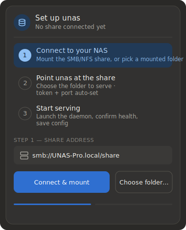
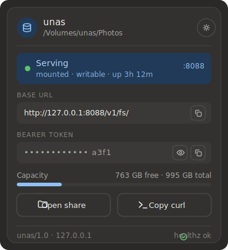

# unas companion

A menu-bar (macOS) / system-tray (Windows, Linux) app for `unasd`. It has two
jobs:

1. **Onboard.** With nothing set up, it shows a wizard:
   - **Connect** — type the share address (`smb://UNAS-Pro.local/share`) and
     mount it; your OS shows its own login dialog (the companion never sees
     your credentials). Already mounted? Just choose the folder.
   - **Point** — pick the folder to serve; the companion finds the `unasd`
     binary.
   - **Serve** — it launches the daemon, waits for `/healthz`, and saves the
     setup so it reconnects automatically next time.
2. **Supervise + watch.** Once configured it starts `unasd` (port `0`, the
   daemon generates the token), restarts it if it dies, stops it on quit, and
   shows live status — serving state, base URL, bearer token (reveal + copy),
   free space, open-share, copy-`curl`.

The daemon owns all real state. It generates the bearer token and writes
`unas.token` (mode `0600`); the companion reads it only to display and copy it,
never persists it, and drops the daemon's token-bearing stdout so the secret
can't reach `unasd.log`. It never touches the share — it only launches the
daemon and reads its HTTP API. HTTP runs in Rust (not the webview) so there's
no CORS to fight.

## What it looks like

<table>
<tr>
<td align="center"><br><sub>First run — setup wizard</sub></td>
<td align="center"><br><sub>Configured — live status</sub></td>
</tr>
</table>

```
ui/              the popover — plain HTML/CSS/JS, inline SVG icons
src-tauri/       the Rust shell: tray, window, setup + supervision commands
build-daemon.sh  builds unasd and stages it as a bundled sidecar
make-icon.py     regenerates the placeholder app icon (stdlib only)
```

## Preview without building

Open `ui/index.html` in any browser — it renders with mock data so you can see
the status card. Append `?setup` to the URL to preview the wizard instead.

## Build & run

Prerequisites: [Rust](https://rustup.rs), Node ≥ 18, and the platform webview
(macOS: built in · Windows: WebView2 · Linux: `webkit2gtk` + `libayatana-appindicator`).

```sh
cd companion
python3 make-icon.py        # writes app-icon.png (replace with your own art)
npm install                 # installs the Tauri CLI
npm run icon                # app-icon.png -> src-tauri/icons/* (all formats)
npm run sidecar             # build unasd + bundle it (macOS: universal binary)
npm run dev                 # run it (first launch shows the setup wizard)
npm run build               # release bundle in src-tauri/target/release/bundle
```

A packaged build **bundles its own `unasd`** as a sidecar — run `npm run sidecar`
first (on macOS it builds a universal arm64+x86_64 binary), and the app prefers
the bundled daemon automatically. Under `npm run dev` (no bundling) it instead
looks for `unasd` next to itself, on `$PATH`, or the usual install dirs, and the
wizard lets you locate a `make`-built `./unasd` if needed.

> Building the `.dmg` needs a desktop login session (it styles the disk-image
> window via Finder). On a headless box or CI, build just the app bundle with
> `npm run build -- --bundles app`.

## Skipping the wizard

To point it at a daemon you already run, set either before launching and it
goes straight to the status card:

- `UNAS_BASE` + `UNAS_TOKEN` — a specific endpoint, or
- `UNAS_STATE` — the daemon's state dir (`unas.port` + `unas.token`).

Use the tray's **Reconfigure…** item to stop the daemon and return to the
wizard.

## Windows

The daemon is POSIX-only (`fork`, POSIX sockets), so it can't run on Windows —
there the companion is a **remote client**. Run `unasd` on your macOS/Linux NAS
host and launch the app with `UNAS_BASE` + `UNAS_TOKEN` set; the wizard detects
this (`host_can_serve`) and shows a remote-client panel instead of the local-
daemon flow.

## Known limitations

- **Mounting** is handed to the OS dialog; the macOS path (`open smb://…`) is
  the most exercised. Windows/Linux mount handoff is implemented but less
  tested.
- **Tray-anchored positioning** is best-effort from the click location;
  pixel-perfect placement and click-away-to-close are per-platform polish.
- The bundled icon is a generated placeholder (`make-icon.py`).
